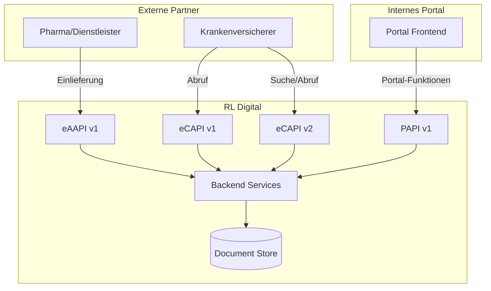
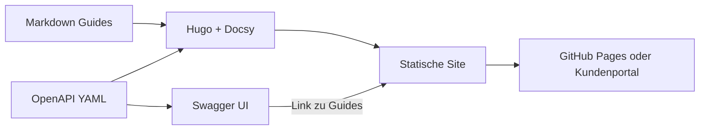

# API- und Dokumentationsarchitektur

```mermaid
flowchart TB
    subgraph Partners[Externe Partner]
      PH[Pharma/Dienstleister]
      KV[Krankenversicherer]
    end

    subgraph RL[RL Digital]
      EA[eAAPI v1]
      EC1[eCAPI v1]
      EC2[eCAPI v2]
      PA[PAPI v1]
      BE[Backend Services]
      DS[(Document Store)]
    end

    subgraph Portal[Internes Portal]
      UI[Portal Frontend]
    end

    PH -->|Einlieferung| EA
    KV -->|Abruf| EC1
    KV -->|Suche/Abruf| EC2
    UI -->|Portal-Funktionen| PA
    EA --> BE
    EC1 --> BE
    EC2 --> BE
    PA --> BE
    BE --> DS
```

## Dokumentationsfluss

```mermaid
flowchart LR
    MD[Markdown Guides] --> H[Hugo + Docsy]
    OA[OpenAPI YAML] --> H
    H --> SITE[Statische Site]
    OA --> SW[Swagger UI]
    SW -->|Link zu Guides| SITE
    SITE --> GH[GitHub Pages oder Kundenportal]
```
