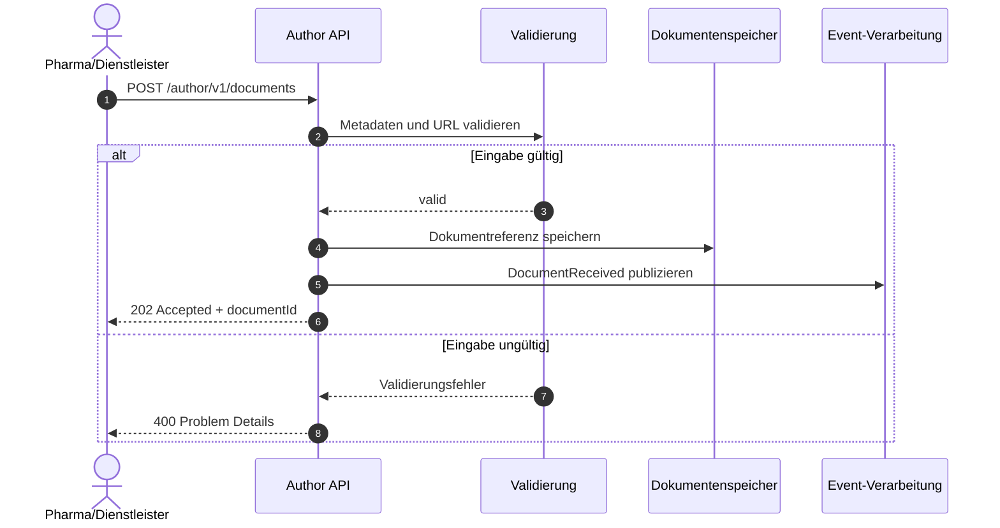
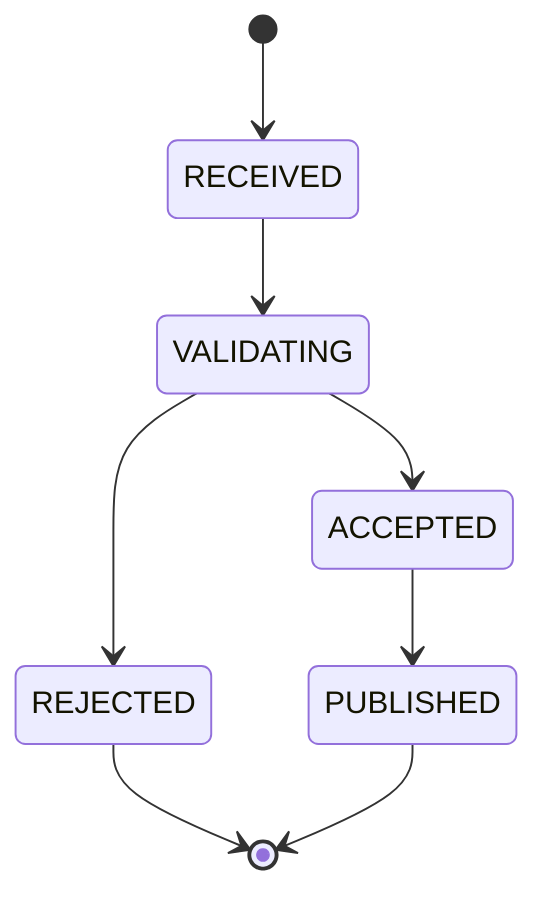

# Einlieferungsprozess

```mermaid
sequenceDiagram
    autonumber
    actor Partner as Pharma/Dienstleister
    participant EA as Author API
    participant VAL as Validierung
    participant STORE as Dokumentenspeicher
    participant EVT as Event-Verarbeitung

    Partner->>EA: POST /author/v1/documents
    EA->>VAL: Metadaten und URL validieren
    alt Eingabe gültig
        VAL-->>EA: valid
        EA->>STORE: Dokumentreferenz speichern
        EA->>EVT: DocumentReceived publizieren
        EA-->>Partner: 202 Accepted + documentId
    else Eingabe ungültig
        VAL-->>EA: Validierungsfehler
        EA-->>Partner: 400 Problem Details
    end
```

## Statusmodell

```mermaid
stateDiagram-v2
    [*] --> RECEIVED
    RECEIVED --> VALIDATING
    VALIDATING --> ACCEPTED
    VALIDATING --> REJECTED
    ACCEPTED --> PUBLISHED
    REJECTED --> [*]
    PUBLISHED --> [*]
```
