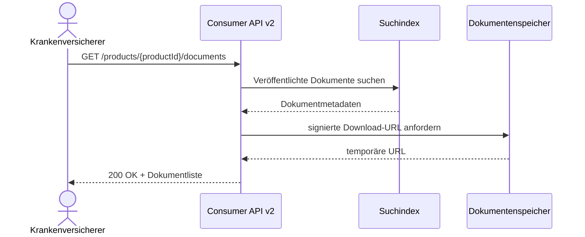

# Dokumentabruf über eCAPI v2

```bash
curl "https://api.example.invalid/consumer/v2/products/PZN-12345678/documents?language=de-DE" \
  --header "Authorization: Bearer ${TOKEN}"
```

```json
{
  "productId": "PZN-12345678",
  "documents": [
    {
      "documentId": "doc-8d417a",
      "language": "de-DE",
      "version": "3.2",
      "publishedAt": "2026-10-01T15:00:00Z",
      "downloadUrl": "https://download.example.invalid/doc-8d417a"
    }
  ]
}
```


