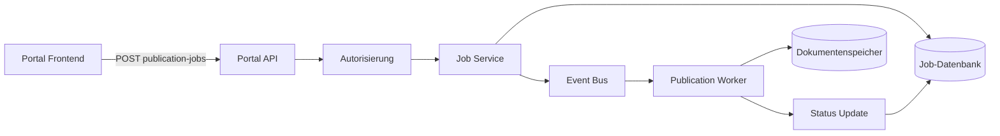

# Veröffentlichungsauftrag

```json
{
  "documentId": "doc-8d417a",
  "target": "CUSTOMER_PORTAL",
  "publishAt": "2026-10-02T08:00:00Z"
}
```


```mermaid
flowchart LR
    UI[Portal Frontend] -->|POST publication-jobs| PAPI[Portal API]
    PAPI --> AUTH[Autorisierung]
    AUTH --> JOB[Job Service]
    JOB --> DB[(Job-Datenbank)]
    JOB --> BUS[Event Bus]
    BUS --> PUB[Publication Worker]
    PUB --> DOC[(Dokumentenspeicher)]
    PUB --> STATUS[Status Update]
    STATUS --> DB
```
